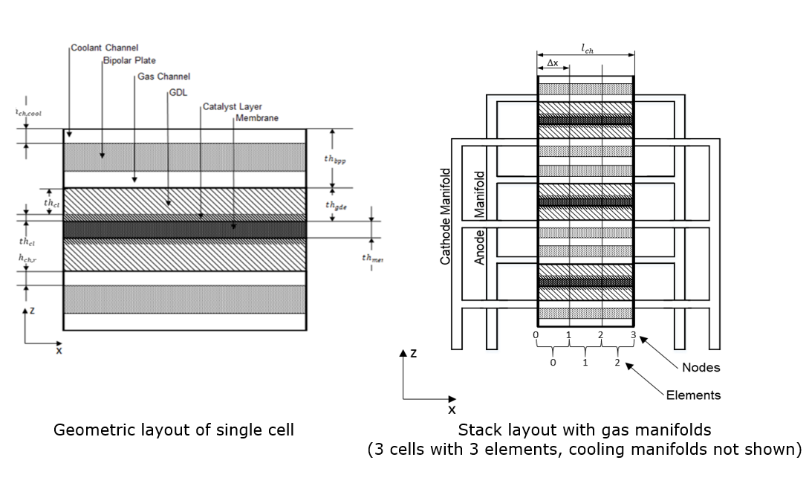
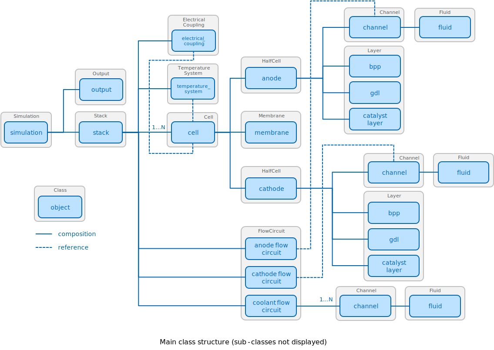

# PEMFC-Stack-Model
A reduced dimensional numerical model to simulate the performance of PEM fuel 
cell stacks developed in Python 3.6 utilizing the numerical libraries NumPy and 
SciPy.

#### Geometric Layout

#### Features
- Physical stack domain is discretized into two dimensions:
    - through each cell in the direction of the electrical current 
      (current-direction)
    - along the flow direction of each channel (flow-direction)

- Calculation of the reactant flow distribution into the cells 
  based on the geometry of headers and channels
  
- Local current distribution along the flow- and current-direction due to:
    - reactant transport within the channels and the porous media
    - temperature distribution
    - reaction kinetics and voltage losses according to Kulikovsky (2013)
     
- Temperature distribution along the flow- and current-direction with a 
  discretization in the current-direction (through plane) in five nodes at 
  the interfaces of:
    - anodic and cathodic bipolar plates (BPP-BPP)
    - anodic bipolar plate and gas diffusion electrode (BPP-GDE, Ano)
    - anodic gas diffusion electrode and membrane (GDE-Mem, Ano)
    - cathodic gas diffusion electrode and membrane (GDE-Mem, Cat)        
    - cathodic bipolar plate and gas diffusion electrode (BPP-GDE, Cat)
  
# Minimum requirements
- NumPy 1.14.3
- SciPy 1.1.0
- Matplotlib 2.2.2

# Usage
Download the repository, review settings in the pemfc/settings folder
(ouput.py, geometry.py, operating_conditons.py, physical_properties.py, 
simulation.py). Then execute 
```python
python -m pemfc.main_app
```

for the CLI app, or

```python
python -m pemfc.gui_app
```

for the GUI app from the repository folder with your Python interpreter. Input
parameters can be adjusted via GUI (work in progress) or in the corresponding 
files in the pemfc/settings folder. If not specified otherwise, a folder 
called "output" will be created at the end of a simulation run, which 
contains the results in various data files and plots.

# Implementation



# References

#### Stack discretization, temperature coupling, reactant transport according to:  
*Chang, Paul, Gwang-Soo Kim, Keith Promislow, and Brian Wetton. “Reduced 
Dimensional Computational Models of Polymer Electrolyte Membrane Fuel Cell 
Stacks.” Journal of Computational Physics 223, no. 2 (May 2007): 797–821. 
https://doi.org/10.1016/j.jcp.2006.10.011.*

#### Membrane models as described in:

*Springer, T. E., T. A. Zawodzinski, and S. Gottesfeld. “Polymer Electrolyte 
FuelCell Model.” Journal of The Electrochemical Society 138, no. 8 (August 1, 
1991): 2334–42. https://doi.org/10.1149/1.2085971.*

*Kamarajugadda, Sai, and Sandip Mazumder. “On the Implementation of Membrane 
Models in Computational Fluid Dynamics Calculations of Polymer Electrolyte 
Membrane Fuel Cells.” Computers & Chemical Engineering 32, no. 7 (July 2008): 
1650–60. https://doi.org/10.1016/j.compchemeng.2007.08.004.*

*Nguyen, Trung V., and Ralph E. White. “A Water and Heat Management Model 
for Proton‐Exchange‐Membrane Fuel Cells.” Journal of The Electrochemical 
Society 140, no. 8 (August 1, 1993): 2178–86. 
https://doi.org/10.1149/1.2220792.*

*Xu, Feina, Sébastien Leclerc, Didier Stemmelen, Jean-Christophe Perrin, 
Alain Retournard, and Daniel Canet. “Study of Electro-Osmotic Drag 
Coefficients in Nafion Membrane in Acid, Sodium and Potassium Forms by 
Electrophoresis NMR.” Journal of Membrane Science 536 (August 2017): 116–22. 
https://doi.org/10.1016/j.memsci.2017.04.067.*

*Peng, Zhe, Arnaud Morin, Patrice Huguet, Pascal Schott, and Joël Pauchet. 
“In-Situ Measurement of Electroosmotic Drag Coefficient in Nafion Membrane 
for the PEMFC.” The Journal of Physical Chemistry B 115, no. 44 (November 10, 
2011): 12835–44. https://doi.org/10.1021/jp205291f.*

#### Manifold model and flow distribution based on:  
*Koh, Joon-Ho, Hai-Kyung Seo, Choong Gon Lee, Young-Sung Yoo, and Hee Chun 
Lim. “Pressure and Flow Distribution in Internal Gas Manifolds of a Fuel-Cell 
Stack.” Journal of Power Sources 115, no. 1 (March 2003): 54–65. https://doi.
org/10.1016/S0378-7753(02)00615-8.*


#### Electrochemical reaction kinetics and transport losses according to:  
*Kulikovsky, A. A. “A Physically–Based Analytical Polarization Curve of a 
PEM Fuel Cell.” Journal of the Electrochemical Society 161, no. 3 (December 
28, 2013): F263–70. https://doi.org/10.1149/2.028403jes.*


